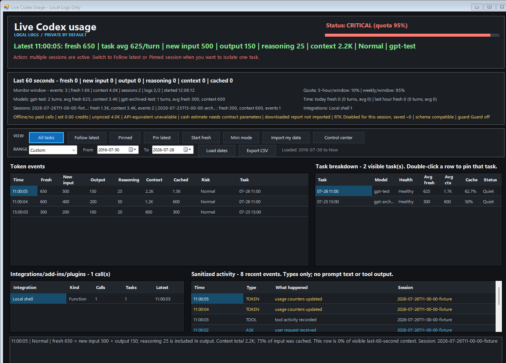
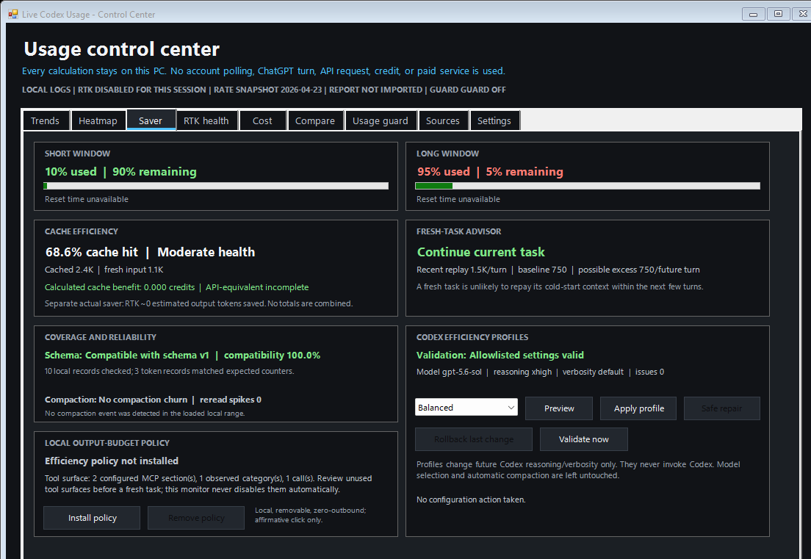

# Live Codex Usage Monitor

[](https://github.com/jsmith4260/live-codex-usage-monitor/actions/workflows/windows-tests.yml)


[](LICENSE)

**A local-only Windows Codex usage monitor, token tracker, quota dashboard, and
usage-efficiency companion.** It turns the Codex logs already on your computer
into a live WinForms dashboard without calling ChatGPT, using an API key, or
creating any additional paid usage.

[Download the latest Windows ZIP](https://github.com/jsmith4260/live-codex-usage-monitor/releases/latest/download/live-codex-usage-monitor-windows.zip)
· [Browse the source](https://github.com/jsmith4260/live-codex-usage-monitor)
· [View the changelog](CHANGELOG.md)
· [Review the privacy model](SECURITY.md)



## Why use it?

Live Codex Usage Monitor is built for an individual who wants a native Windows
view of Codex usage while keeping personal activity on the same computer.

| Capability | What you get |
| --- | --- |
| Live usage | The actual Codex chat title, originating Codex client, fresh input, output, reasoning, cached context, chat health, and model mix from local Codex files, with a persistent 1-60 second refresh interval |
| Quota awareness | Independent short- and long-window meters, reset times, pace, warnings, and an optional usage guard |
| Usage Saver | Prompt-cache efficiency, fresh-task break-even advice, compaction health, and reversible Saver/Balanced/Quality profiles |
| History | Today, 7-day, 30-day, all-available, or any custom inclusive date range |
| Windows reliability | Single-instance launch behavior, tray restoration, hidden-console launchers, sanitized diagnostics, and local backup/restore |
| Personal ChatGPT coverage | Manual, local comparison of a downloaded single-user report for Chat/Work on web, desktop, or mobile; Excel, Google Sheets, PowerPoint, GPTs, Projects, Skills, and Apps where the report includes them |
| Cost context | Clearly labeled Codex credit estimates, API-equivalent rates where known, and user-configured spending parameters |
| Privacy | No account polling, cookies, telemetry upload, prompt storage, network service, or monitoring-generated ChatGPT cost |
| OpenAI reports | Privacy-safe JSON aggregates by day, week, month, or anonymized session; local time-zone selection; no titles, paths, content, or identifiers |

## Quick start

1. [Download the latest Windows ZIP](https://github.com/jsmith4260/live-codex-usage-monitor/releases/latest/download/live-codex-usage-monitor-windows.zip) and extract it.
2. Double-click `START-HERE.cmd`.
3. Use **Control center** to open Trends, Saver, RTK health, Cost, Compare, Usage guard, Sources, and Settings.

There is no installer, account sign-in, API key, or runtime package download.
The project runs on Windows PowerShell 5.1 or newer.
Starting either launcher again restores the existing monitor window instead of
creating a duplicate process.

To install with Git instead:

```powershell
git clone https://github.com/jsmith4260/live-codex-usage-monitor.git
Set-Location .\live-codex-usage-monitor
.\START-HERE.cmd
```

### Work PCs and script signing

`START-HERE.cmd` prevents a downloaded ZIP's Windows Internet marker from
causing a silent startup failure. It unblocks only PowerShell source files
inside the extracted monitor folder and does not change execution policy,
registry settings, or administrator controls.

If your organization enforces `AllSigned` or `Restricted`, it stops and shows
an IT-facing explanation instead of trying to bypass the policy. Releases are
SHA-256 checksummed but are not currently Authenticode-signed. See the
[work-PC installation guide](docs/WORK-PC-INSTALLATION.md).

## Purpose

Use this monitor to understand the shape of local Codex work without creating more ChatGPT work. It helps distinguish fresh token use from replayed context, identify unusually large turns, forecast usage, compare a downloaded official report with local estimates, and see which local tasks are active. Estimates are always labeled and are not an OpenAI invoice.

## Requirements

- Windows with PowerShell 5.1 or newer.
- Codex desktop or CLI that writes session logs under `~\.codex\sessions` or `~\.codex\archived_sessions`.
- No API key, account token, network connection, or additional package is required.
- RTK is optional. When installed, its local aggregate history powers the RTK health tab; the monitor never downloads RTK at runtime.

## Privacy and safety

- The monitor does not invoke Codex, call ChatGPT, poll an account endpoint, or contact a network service.
- Monitoring itself creates no ChatGPT messages, turns, tokens, credits, API requests, overages, agent activity, or other paid usage.
- Its automatic live input is your existing local Codex JSONL. Downloaded usage summaries and activity exports enter only through explicit local-file workflows and must be limited to one individual.
- Optional RTK diagnostics read only RTK's local aggregate savings/history output. The monitor forces `RTK_TELEMETRY_DISABLED=1` for every RTK child process.
- The Saver workspace reads only aggregate counters and allowlisted Codex configuration keys. It never persists a full `config.toml`, tool/server name, command, argument, or raw log line.
- Efficiency profiles, safe configuration repair, rollback, and the optional output-budget policy require affirmative in-app actions. None is silently enabled.
- The dashboard reads Codex's local `session_index.jsonl` to show the actual chat title. Titles stay in memory and are never exported. If the index has no matching entry, the UI says **Title unavailable** beside the timestamp instead of presenting a time as though it were a title.
- Prompts, responses, tool arguments, tool output, credentials, client data, and working-directory paths are not persisted or transmitted.
- Local CSV output contains daily counts and token totals only. It excludes task names, session IDs, source paths, prompts, responses, and tool data.
- The optional persistent history under `%LOCALAPPDATA%\LiveCodexUsageMonitor` contains dates and aggregate counters only. It never contains prompts, responses, session names, account identifiers, or source paths. Use `-DisablePersistence` to turn it off.
- `Test-ZeroOutbound.ps1` is a release gate that rejects outbound-request APIs in production PowerShell sources.

## Launch options

- Recommended first launch after downloading: `START-HERE.cmd`
- Full dashboard by double-click: `Start-Live-Codex-Usage.cmd`
- Mini always-visible view by double-click: `Start-Live-Codex-Usage-Mini.cmd`
- Full dashboard from PowerShell:

```powershell
& .\Start-Live-Codex-Usage.ps1
```

- Mini view from PowerShell:

```powershell
& .\Start-Live-Codex-Usage-Mini.ps1
```

Do not paste the contents of a `.cmd` file into PowerShell. `.cmd` files are batch files for Command Prompt/double-click; `.ps1` files are PowerShell scripts.

- Manual PowerShell:

```powershell
powershell -NoProfile -ExecutionPolicy Bypass -File .\Live-Codex-Usage-GUI.ps1
powershell -NoProfile -ExecutionPolicy Bypass -File .\Live-Codex-Usage-GUI.ps1 -StartMini
```

## Useful options

```powershell
# Watch all active tasks instead of only the latest one
powershell -NoProfile -ExecutionPolicy Bypass -File .\Live-Codex-Usage-GUI.ps1 -InitialView "All sessions"

# Override the saved refresh interval for this launch
powershell -NoProfile -ExecutionPolicy Bypass -File .\Live-Codex-Usage-GUI.ps1 -PollSeconds 10

# Set the initial startup window to the last 48 hours
powershell -NoProfile -ExecutionPolicy Bypass -File .\Live-Codex-Usage-GUI.ps1 -HistoryHours 48

# Start on an exact inclusive date range
powershell -NoProfile -ExecutionPolicy Bypass -File .\Live-Codex-Usage-GUI.ps1 -FromDate 2026-07-01 -ToDate 2026-07-31

# Exclude archived sessions when only active history is wanted
powershell -NoProfile -ExecutionPolicy Bypass -File .\Live-Codex-Usage-GUI.ps1 -IncludeArchivedSessions:$false

# Legacy fallback only: derive an in-memory label from the first local request
# when the Codex chat index has no matching title
powershell -NoProfile -ExecutionPolicy Bypass -File .\Live-Codex-Usage-GUI.ps1 -ShowPromptTaskTitles

# Write a local, content-free JSON report (Daily, Weekly, Monthly, or Session)
powershell -NoProfile -ExecutionPolicy Bypass -File .\Live-Codex-Usage-GUI.ps1 `
  -ReportJsonPath C:\MyReports\codex-weekly.json -ReportGroupBy Weekly `
  -ReportingTimeZone 'Eastern Standard Time'

# Raise or lower spike thresholds
powershell -NoProfile -ExecutionPolicy Bypass -File .\Live-Codex-Usage-GUI.ps1 -WarnMinuteFreshTokens 50000 -WarnContextTokens 150000

# Persistently turn Windows usage-alert notifications off or back on.
# Restart a running monitor after changing this setting.
powershell -NoProfile -ExecutionPolicy Bypass -File .\Live-Codex-Usage-GUI.ps1 -WindowsNotifications Off
powershell -NoProfile -ExecutionPolicy Bypass -File .\Live-Codex-Usage-GUI.ps1 -WindowsNotifications On

# Disable RTK health checks for this launch, or point to an approved RTK binary
powershell -NoProfile -ExecutionPolicy Bypass -File .\Live-Codex-Usage-GUI.ps1 -DisableRtkIntegration
powershell -NoProfile -ExecutionPolicy Bypass -File .\Live-Codex-Usage-GUI.ps1 -RtkExecutablePath C:\ApprovedTools\rtk.exe

# Controlled troubleshooting only: bypass normal per-user single-instance behavior
powershell -NoProfile -ExecutionPolicy Bypass -File .\Live-Codex-Usage-GUI.ps1 -AllowMultipleInstances
```

## What it tracks

- Fresh token burn: new input + output. Reasoning tokens are displayed separately but are already included in output.
- Replayed context separately from fresh work, so cached context does not look like a new charge.
- Chat breakdown with the actual Codex title, model, recent activity, averages, cache ratio, and health.
- View buttons for All chats, Latest chat, and Pinned.
- **Today**, **Last 7 days**, **Last 30 days**, **All available**, and **Custom** history ranges.
- **From** and **To** calendar selectors that load complete local history for any inclusive date range.
- Active and archived Codex sessions.
- Actual Codex chat titles from the local chat index, held in memory only and excluded from exports. An explicit **Title unavailable** label plus timestamp is the fallback.
- A Settings toggle to hide local chat titles, a separate toggle for Windows alert pop-ups, and a privacy-safe reporting time-zone selector.
- Integration/tool activity counts by local shell, file edits, web, MCP/app/plugin names, waits, and plan updates.
- Optional RTK aggregate shell-output savings, daily reduction estimates, freshness, parser failures, and possible-prefix-bypass warnings.
- Prompt-cache hit rate and calculated full-rate credit/API-equivalent differences, kept separate from RTK's estimated shell-output savings.
- Fresh-task break-even advice, local compaction-churn detection, and versioned aggregate schema-drift detection.
- Independent short- and long-window quota meters with reset and pace text when local logs provide the fields.
- OK/WARN/CRITICAL status, a matching color meter, quota reset countdowns, and an even-pace comparison when the log supplies a window duration.
- Privacy-safe daily CSV export through **Export CSV**.
- A system-tray menu with dashboard, mini-mode, Control Center, and exit actions.
- Per-user single-instance coordination that restores the existing tray/dashboard window when a launcher is run again.

## Control Center

Open **Control center** or press `Ctrl+I`.

- **Trends**: daily fresh-token history, a trailing observed-day forecast, and a text table matching the chart.
- **Heatmap**: local day/hour activity with both text and an accessible color-intensity cue.
- **Saver**: independent quota meters, cache efficiency, fresh-task break-even advice, compaction/schema health, aggregate tool-surface review, removable output-budget policy, and previewable reversible Codex efficiency profiles.
- **RTK health**: local-only command-output reduction estimates, daily history, freshness, parser/fallback failures, and possible bypass status.
- **Cost**: official credit estimates for known models, API-equivalent USD only where a current official API rate is published, and optional contract parameters for a configured cash estimate.
- **Compare**: local daily credit estimates versus a downloaded personal CSV/JSON, with variance, coverage, and freshness labels.
- **Official history**: aggregate checkpoints copied from the signed-in official Codex analytics dashboard, with same-period turn and plugin-call reconciliation plus clear official-only metrics.
- **Usage guard**: disabled by default. Advisory mode warns; explicitly approved Enforced mode stops only exact user-approved Codex executable paths after a grace period.
- **Sources**: provenance, model mix, state locations, and the privacy/zero-cost contract.
- **Settings**: personal backup/restore, start-at-sign-in, sanitized diagnostics, RTK coverage, and guard reliability.



The bundled rate card is dated. Unknown model names remain unpriced; the app never guesses a fallback unless you explicitly configure one. Fast or special service tiers can use a user-supplied multiplier. Actual dollars are shown only after you provide your own dollars-per-credit, included-credit, fixed-cost, and billing-cycle parameters.

Downloaded reporting is not real-time. Workspace Analytics normally refreshes in 1-24 hours, typically 6-12 hours, with a service target of up to 48 hours. The app labels report age and never fetches the report itself. Put your downloaded snapshots in `%LOCALAPPDATA%\LiveCodexUsageMonitor\official-reports` or select a local file.

For dashboard-only aggregates, open **Official history** in the Control Center and choose **Record dashboard snapshot**. Enter the displayed period and only the counts visible in the official Codex analytics page. The app persists aggregate totals and reconciles same-period turns and plugin calls with its local logs. Lines of code, skills, credits, and tokens remain explicitly official-only; they are never folded into local token or cost totals.

See [offline cost, reconciliation, and guard details](docs/OFFLINE-COST-RECONCILIATION-GUARD.md).
See [RTK savings and health](docs/RTK-SAVINGS-AND-HEALTH.md) for exact measurement and failure-state semantics.
See [Usage Saver and efficiency](docs/USAGE-SAVER-AND-EFFICIENCY.md) for savings labels, profiles, schema checks, the local policy, and rollback boundaries.
See [Windows reliability and distribution](docs/WINDOWS-RELIABILITY-AND-DISTRIBUTION.md) for single-instance behavior, launchers, releases, and issue privacy.

## Reading the dashboard

- **Fresh** is uncached/new input plus output for a completed turn. Reasoning is a subset of output and is not counted twice.
- **Context** is the total context presented to the model. Much of it can be cached/replayed task history, so it is not equivalent to new usage.
- **Last 60 seconds** is the live window used for the header status and meter. Older task spikes do not keep the header in a Critical state.
- **Chat using tokens now** names the actual Codex chat associated with the newest completed turn.
- **Token source now** names the local Codex client that produced the measured token event. The adjacent coverage note distinguishes live tokens, imported ChatGPT activity, and separate API usage.
- **Chats using tokens** groups usage by chat title. Use **Latest chat** to follow the newest chat or double-click a row to focus it.
- **Recent turns** keeps the chat title and source next to each token event so spikes are attributable at a glance.
- **Alerts: On/Off** is a dashboard-level toggle for Windows usage-alert notifications. It applies immediately and saves the preference.
- **Technical details** reveals integration counts and sanitized activity only when needed; it never shows tool inputs or outputs.

## Keyboard shortcuts

- `Ctrl+L`: load the selected date range.
- `Ctrl+E`: export the visible privacy-safe daily summary.
- `Ctrl+M`: toggle mini mode.
- `Ctrl+I`: open the Control Center.
- `F5`: refresh immediately.

## Status behavior

The header is **OK**, **WARN**, or **CRITICAL** based on the latest quota metadata when present; otherwise it evaluates fresh token use in the last minute plus active task health. A previous task's spike cannot leave the monitor stuck at Critical after the task is no longer active.

## Personal ChatGPT coverage

ChatGPT Chat and Work on web, desktop, and mobile; ChatGPT for Excel, Google Sheets, and PowerPoint; and GPT, Project, Skill, and App activity do not write the same Codex JSONL token events. Additional personal coverage must come from a downloaded report rather than browser interception, process scraping, or keylogging. OpenAI API usage remains a separate source and is not read by this offline monitor.

Click **Import activity** to open a usage-summary CSV or an advanced activity JSONL export that has been filtered to your own account. The app rejects a report containing more than one identity. It shows your message, tool, model, surface, and date aggregates without displaying or retaining names, email addresses, IDs, prompt text, or response text.

Personal imports remain manual and local because the monitor never signs in, reads browser cookies, or makes paid/account API calls. Coverage depends on what your downloaded report actually contains, and activity/message counts are never relabeled as token totals.

See the [personal data-source boundary](docs/ENTERPRISE-DATA-SOURCES.md), [personal settings and recovery](docs/PERSONAL-SETTINGS-AND-RECOVERY.md), and [activity export normalizer](docs/COMPLIANCE-NORMALIZER.md).

## Offline personal activity export normalization

If you have a downloaded activity JSONL that is filtered to your account, adapt `config\compliance-mapping.example.json` to its field names and run:

```powershell
powershell -NoProfile -ExecutionPolicy Bypass -File .\Convert-Enterprise-ComplianceExport.ps1 `
  -InputPath C:\MyExports\personal-activity-export.jsonl `
  -MappingPath .\config\compliance-mapping.example.json `
  -OutputPath C:\MyExports\personal-activity-summary.csv
```

The result contains date, surface, event type, model, event count, and unique-user count only. The importer rejects the result if it represents more than one identity. The tool does not call an account or activity API or retain a raw identifier.

## What it does not do

- It does not call OpenAI.
- It does not send local logs anywhere.
- It does not persist raw telemetry. The enabled-by-default local history store contains aggregate daily counters only and can be disabled with `-DisablePersistence`.
- It does not persist or send prompts, responses, chat titles, tool arguments, tool output, credentials, client data, or working-directory paths. Local chat titles are displayed only in memory; the optional prompt-derived fallback also remains in memory.
- It does not claim estimates are an OpenAI invoice or account balance.
- It does not claim RTK's byte-derived shell-output estimate is a billed-token count, quota reduction, or cash saving.
- It does not combine RTK estimates, calculated cache benefits, or optimization opportunities into a misleading total.
- It does not apply an efficiency profile, repair configuration, change automatic compaction, or install an output policy without an affirmative click.
- It does not silently price unknown models or assign an actual cash value to a credit.
- It does not implement a live account or activity API collector, accept account credentials, or bypass product reporting controls.
- It does not use an undocumented account endpoint or browser scraping. The optional official-dashboard history records aggregate values you explicitly enter from the signed-in page; an administrator-authorized Analytics API integration is a separate future configuration.
- It does not inspect browser cookies/history, Office documents, prompts, keystrokes, TLS traffic, or private account endpoints.
- It does not track, compare, rank, or report on other people. Multi-user imports are rejected.
- The local guard does not block ChatGPT web, Office add-ins, another device, or launches after the monitor exits. Enterprise-mandatory blocking belongs in approved workspace and endpoint policies.
- The scheduled rate-card review reminder creates a GitHub issue for human review only. It never changes the bundled rate card or gives the running application network access.

## QA

Double-click `Test-Live-Codex-Usage.cmd`, or run:

```powershell
& .\Test-Live-Codex-Usage.ps1
powershell -NoProfile -ExecutionPolicy Bypass -File .\Live-Codex-Usage-GUI.ps1 -Once
powershell -NoProfile -ExecutionPolicy Bypass -File .\Live-Codex-Usage-GUI.ps1 -UiSmokeTest -NoNotifications -NoSound
powershell -NoProfile -ExecutionPolicy Bypass -File .\Live-Codex-Usage-GUI.ps1 -MiniSmokeTest -NoNotifications -NoSound
powershell -NoProfile -ExecutionPolicy Bypass -File .\Live-Codex-Usage-GUI.ps1 -IntegrationSmokeTest
powershell -NoProfile -ExecutionPolicy Bypass -File .\Live-Codex-Usage-GUI.ps1 -TaskSmokeTest
powershell -NoProfile -ExecutionPolicy Bypass -File .\Live-Codex-Usage-GUI.ps1 -DateRangeSmokeTest
powershell -NoProfile -ExecutionPolicy Bypass -File .\Live-Codex-Usage-GUI.ps1 -StatusSmokeTest
powershell -NoProfile -ExecutionPolicy Bypass -File .\Live-Codex-Usage-GUI.ps1 -EfficiencySmokeTest
powershell -NoProfile -ExecutionPolicy Bypass -File .\Live-Codex-Usage-GUI.ps1 -AlertSmokeTest
powershell -NoProfile -ExecutionPolicy Bypass -File .\Live-Codex-Usage-GUI.ps1 -InsightsUiSmokeTest -DisablePersistence
powershell -NoProfile -ExecutionPolicy Bypass -File .\Test-ZeroOutbound.ps1
```

The test wrapper uses deterministic local fixtures, checks child exit codes, verifies fresh-token semantics, exercises date ranges and archived logs, validates both quota windows, constructs all UI surfaces, tests cache/advisor/schema/compaction logic, tests profile preview/apply/repair/rollback and policy install/remove in temporary files, tests RTK health with a fake local runner, tests pricing/reconciliation/persistence/guard logic with fake processes, and proves that aggregate outputs do not expose fixture prompt text or direct identifiers.

## Build a release

```powershell
& .\Build-Release.ps1
```

The build parses every PowerShell file, runs the full QA suite, and creates a versioned ZIP plus SHA-256 manifest under `artifacts`. GitHub Actions performs the same validation and publishes the package as a workflow artifact. A matching `vX.Y.Z` tag additionally runs the release workflow and publishes versioned and stable-name assets to GitHub Releases.

## Feedback and contributions

Bug reports, feature ideas, accessibility feedback, and Windows compatibility
reports are welcome in [GitHub Issues](https://github.com/jsmith4260/live-codex-usage-monitor/issues).
Please do not attach personal Codex logs, prompts, responses, account exports, or
other sensitive data to an issue.

## License

Live Codex Usage Monitor is open-source software available under the
[MIT License](LICENSE).
